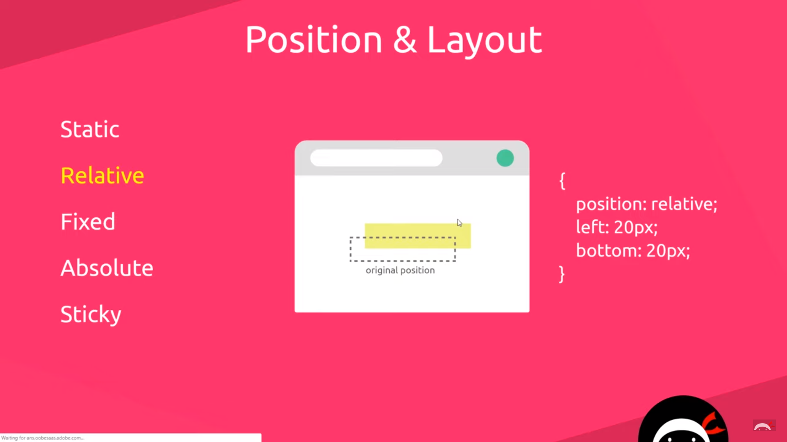
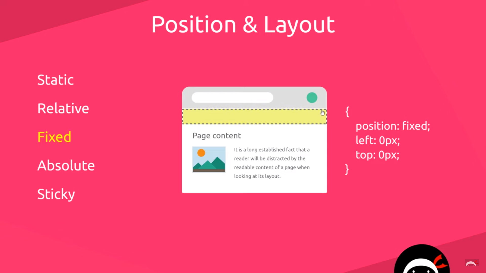
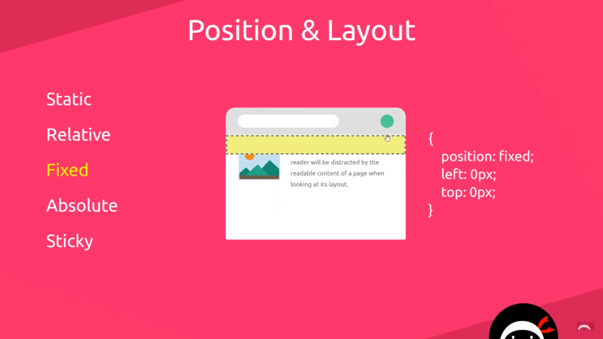
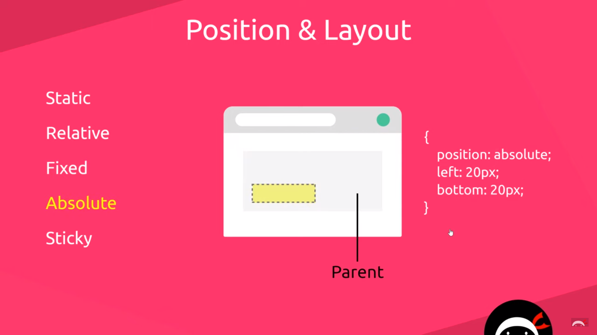
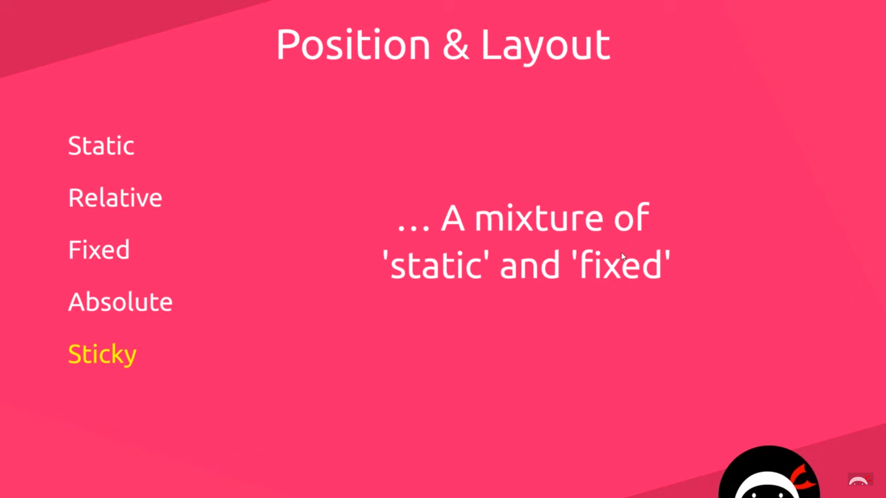

# HTML5 Semantic Tags

```HTML
<div>
    <p>Some Content</p>
    <p>Some more Content</p>
</div>
```

- Make this HTML Code more semantic.

```html
<article>
	<p>Some Content</p>
    <p>Some more content</p>
</article>
```

```HTML
HTML5 Semantic Tags


<main>
For the main content of a webpage, unique to that page

<section>
Defines a certain section of a webpage (e.g. blog list, contact info)

<article>
Defines a bit of content which makes up an article (e.g. a blog post)

<aside>
Defines some content related to something else (e.g. similar blogs)

<header>
For the header of a website - contains the nav, title etc

<footer>
For the footer of a website
```

# Position & Layout

```HTML
Static (by default)

Relative

Fixed

Absolute

Sticky
```














## The Relationship between Relative and Absolute

상황:  아래 사진을 담고 있는 태그가 relative position이라고 생각해보자. 좌측 중간쯤에 Welcome! 이라는 단어를 Responsive 하게 30% 크기로 삽입하고 싶다고 생각해보자.


1. 위 사진을 담고 있는 div or semantic tag 가 parent이고 삽입할 welcome 이라는 content를 담고 있는 어떤 tag가 child가 될 것이다. 이때 child는 parent를 기준으로 좌표를 잡아야하기 때문에 parent는 relative가 되어야하고 child는 absolute가 되면된다. Child는 parent에 종속되기 때문에 parent의 사진이나 어떤 content에 설정을 하고 싶다면 absolute를 사용하면된다.

## Sticky

position: sticky의 경우  104px 만큼 scroll down시 그때부터 position: fixed 되는 것을 의미한다.

```css
nav {
	position: sticky;
    top: 104px;
}
```


## Fixed

position: fixed의 경우 다른 태그에서 position: relative 등을 사용했을때 한 층 아래로 내려가기때문에 z-index: 1을 이용해 동일한 층으로 만들어주면 된다.

```css
header {
    background-color: red;
    text-align: center;
    position: fixed;
    width: 100%;
    padding: 20px;
    z-index: 1;
    color: white;
    top: 0;
    left: 0;
}


.banner {
    position: relative;
}
```

## box-sizing

box-sizing의 경우 width: 1200px; 일때 margin + padding 등등 모든 것을 합친 크기가 1200px을 의미한다.

## Parent-Child

```css
.images li {
    display: inline-block;
    width: 40%;
    margin: 20px 5%;
}

.images li img {
    /* 부모가 40% = 자식의 100% */
    max-width: 100%;
}
```

